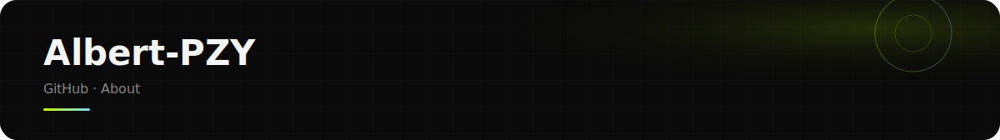

<!-- Profile About — data & activity only -->

  

  

  

  
  
  
  

---

<table align="center" width="100%">
  <tr>
    <td align="center" width="50%">
      
    </td>
    <td align="center" width="50%">
      
    </td>
  </tr>
</table>

  

  

<!-- Contribution snake (auto-refreshed daily) -->

  <picture>
    <source media="(prefers-color-scheme: dark)" srcset="./assets/activity/github-snake-dark.svg" />
    <source media="(prefers-color-scheme: light)" srcset="./assets/activity/github-snake.svg" />
    
  </picture>

<!-- Area graph: generic title only — no username banner -->

  

  

  

