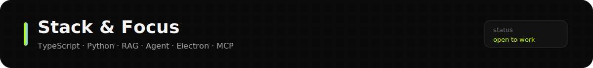
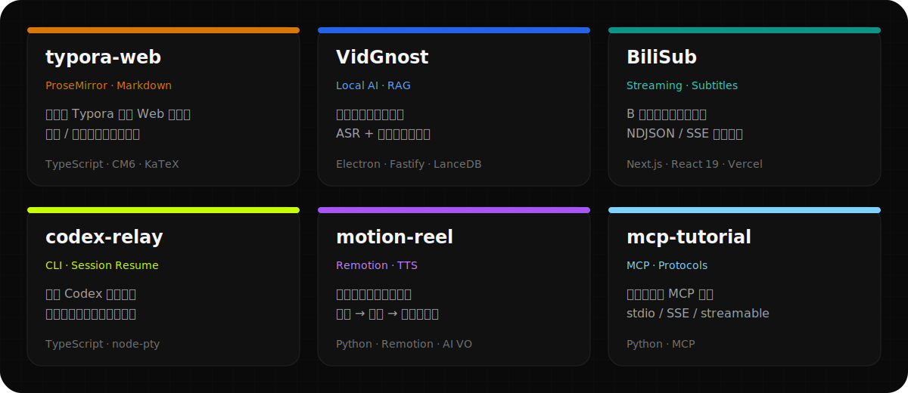
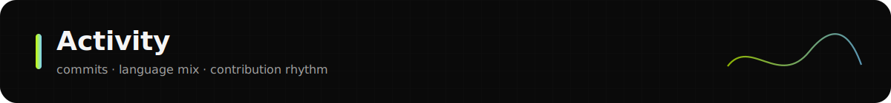

<!--
  GitHub Profile README for Albert-PZY
  Special repo: Albert-PZY/Albert-PZY
  Renders on: https://github.com/Albert-PZY
-->

  

  

  
  &nbsp;
  
  &nbsp;
  
  &nbsp;
  

  

### 👋 About

我是 **Albert**（`@Albert-PZY`），全栈与 AI 应用开发工程师，常驻 **北京 / 远程**。

- 主攻 **RAG 检索增强**、**Agent 智能体**、本地小模型（ASR / 推理）与桌面端集成
- 技术栈以 **TypeScript / React / Node.js** 与 **Python** 为核心
- 关心工程细节：SSE 流式连接生命周期、上下文窗口、检索噪音、类型契约与可观测性
- 也做编辑器内核（ProseMirror / CodeMirror）与 CLI / MCP 工具

> 深入理解大模型在工程层面的痛点，不只是接 API，更要解决流式恢复、上下文管理与本地推理调度等生产问题。

---

  

  

| 方向 | 内容 |
| :--- | :--- |
| **AI / LLM** | RAG、混合检索、语义分段、Tool Call、MCP、SSE / NDJSON 流式控制、本地推理（Ollama / CTranslate2） |
| **Full-stack** | TypeScript、React / Next.js、Fastify、Electron 多进程、pnpm monorepo、前后端类型契约 |
| **工程实践** | 请求取消与连接隔离、会话加密、CI/CD、任务日志与性能排查 |

---

  

  

| 项目 | 一句话 | 链接 |
| :--- | :--- | :--- |
| **[typora-web](https://github.com/Albert-PZY/typora-web)** | 高保真 Typora 风格 Web Markdown 编辑器 | [Demo](https://albert-pzy.github.io/typora-web/) |
| **[VidGnost](https://github.com/Albert-PZY/VidGnost)** | 本地优先视频知识库 + 时间戳 RAG 问答 | Repo |
| **[BiliSub](https://github.com/Albert-PZY/BiliSub)** | B 站字幕流式转写与校对平台 | [Live](https://bili-sub.vercel.app) |
| **[codex-relay](https://github.com/Albert-PZY/codex-relay)** | Codex CLI 号池切换，额度耗尽时恢复上下文 | Repo |
| **[motion-reel](https://github.com/Albert-PZY/motion-reel)** | Remotion + AI 旁白生成项目宣传片 | Repo |
| **[mcp-tutorial](https://github.com/Albert-PZY/mcp-tutorial)** | 可运行的 MCP 多协议最小示例 | Repo |

<b>更多项目</b>

- **[pubfetch](https://github.com/Albert-PZY/pubfetch)** — 微信公众号文章批量下载浏览器扩展
- **[agent-skill-workbench](https://github.com/Albert-PZY/agent-skill-workbench)** — 自建 Agent 技能库
- **[iDME-xDM-F-demo](https://github.com/Albert-PZY/iDME-xDM-F-demo)** — 工业零部件加工数字化 MiniApp + RAG 助手 Demo
- **[myself](https://github.com/Albert-PZY/myself)** — 在线个人介绍与简历站

---

  

  
  

  

  

---

  

  开放 <b>全栈</b> 与 <b>AI 应用</b> 相关机会 · 北京 / 远程 / 可协商

  
  &nbsp;
  
  &nbsp;
  

  

  Built with ❤️ · visual system aligned with <a href="https://github.com/Albert-PZY/myself">myself</a>

