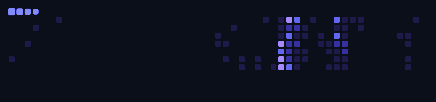

 

 
 

 

## 🛠️ Tech Stack

 

## 📊 GitHub Stats

  

 

## 🐍 Contribution Activity

  <picture>
    <source media="(prefers-color-scheme: dark)" srcset="./assets/activity/github-snake.gif" />
    <source media="(prefers-color-scheme: light)" srcset="./assets/activity/github-snake.gif" />
    
  </picture>

 

  

